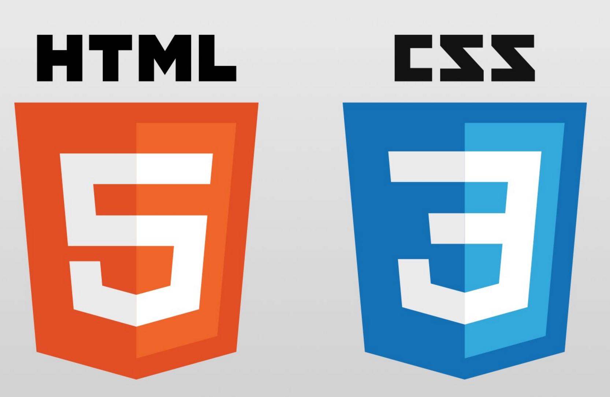

 
  
<h1 align="center">Index of HTML & CSS Projects</h1>

<table>
    <thead>
        <tr>
            <td>Project Name</td>
            <td>Repo Link</td>
            <td>App Link</td>
            <td>Overview</td>
        </tr>
    </thead>
    <tbody> <tr>
            <td>Team_members_project</td>
            <td><a href="https://github.com/Meltem-Karaagac/Team_member_project" target="_blank">Repo details</a></td>
            <td><a href="https://meltem-karaagac.github.io/Team member project/" target="_blank">App details</a></td>
            <td></td> 
        </tr>
        <tr>
            <td>Web_dizayn_project</td>
            <td><a href="https://github.com/Meltem-Karaagac/Web_dizayn_project" target="_blank">Repo details</a></td>
            <td><a href="https://meltem-karaagac.github.io/Web dizayn project/" target="_blank">App details</a></td>
           <td></td> 
        </tr>
        <tr>
            <td>Google_landing_page</td>
            <td><a href="https://github.com/Meltem-Karaagac/Google_landing_page" target="_blank">Repo details</a></td>
            <td><a href="https://meltem-karaagac.github.io/Google landing page/" target="_blank">App details</a></td>
             <td></td> 
        </tr>
        <tr>
            <td>Parallax_website</td>
            <td><a href="https://github.com/Meltem-Karaagac/Parallax_Website" target="_blank">Repo details</a></td>
            <td><a href="https://meltem-karaagac.github.io/Parallax Website/" target="_blank">App details</a></td>
             <td></td> 
        </tr>
        <tr>
            <td>Checkout_form</td>
            <td><a href="https://github.com/Meltem-Karaagac/Checkout_form" target="_blank">Repo details</a></td>
            <td><a href="https://meltem-karaagac.github.io/Checkout form/" target="_blank">App details</a></td>
             <td></td> 
        </tr>https://meltem-karaagac.github.io/NetFlix/
        <tr>
            <td>Netflix_servey_form</td>
            <td><a href="https://github.com/Meltem-Karaagac/NetFlix" target="_blank">Repo details</a></td>
            <td><a href="https://meltem-karaagac.github.io/NetFlix/" target="_blank">App details</a></td>
            <td></td> 
        </tr>
        
     
</tbody>
</table>

